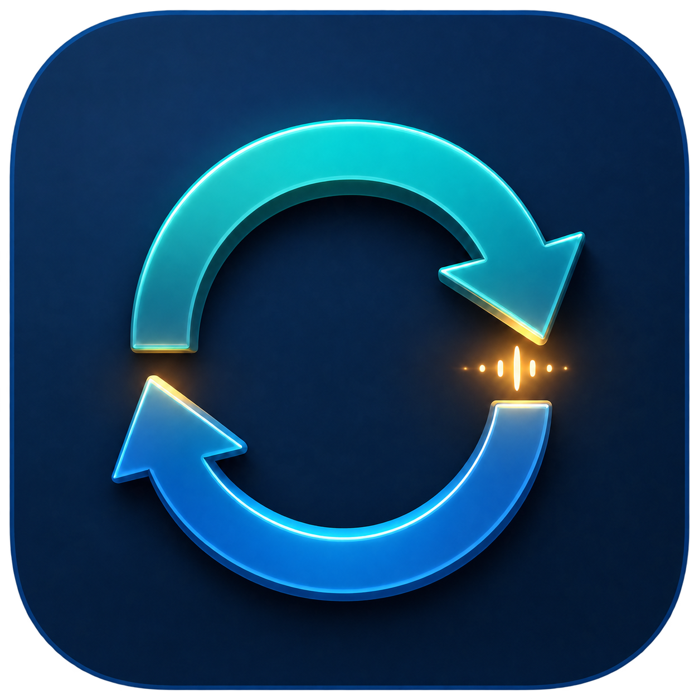
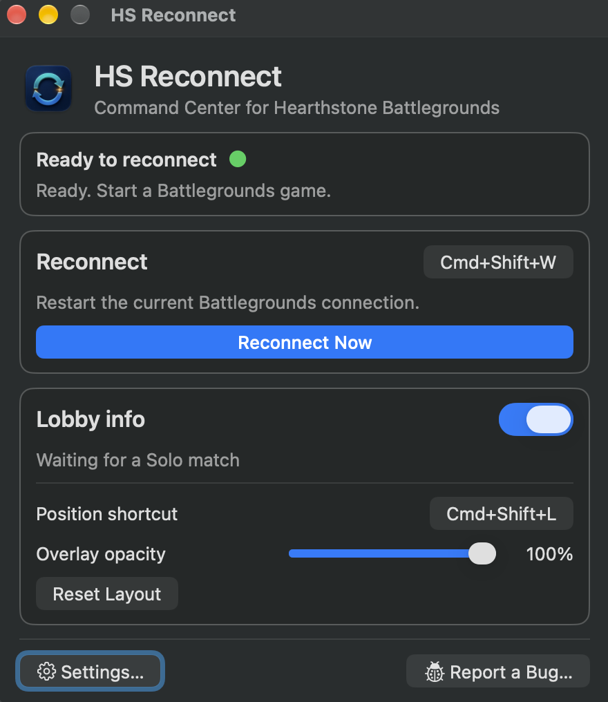

  

<h1 align="center">HS Reconnect and lobby ratings for Mac</h1>

  Reconnect to Hearthstone Battlegrounds with a shortcut. See Solo lobby ratings in a movable overlay.

<h3 align="center">
  <a href="https://github.com/kulibabkaaa/Hearthstone-Reconnect-MacOS/releases/latest/download/HS-Reconnect-2.0.0.dmg">Download HS Reconnect</a>
  &nbsp;·&nbsp;
  <a href="https://kulibabkaaa.github.io/Hearthstone-Reconnect-MacOS/">Visit the website</a>
</h3>

  

## What it does

- **Reconnect:** Press **Command-Shift-W** during a Battlegrounds match to restart its connection without quitting Hearthstone. You can change the shortcut.
- **Lobby ratings:** See player names, public leaderboard ranks and ratings, and an estimated Solo lobby average. Press **Command-Shift-L** to move or resize the overlay.
- **Stay ready:** Open with Hearthstone and keep the app in the menu bar, the Dock, or both.

HS Reconnect requires **macOS 13 or later** and the **native Mac version of Hearthstone**. It supports Apple silicon and Intel Macs.

## Install

1. [Download the DMG](https://github.com/kulibabkaaa/Hearthstone-Reconnect-MacOS/releases/latest/download/HS-Reconnect-2.0.0.dmg), open it, and run **Install HS Reconnect.pkg** inside.
2. Open HS Reconnect and choose **Set Up Reconnect**. Follow the app's directions to allow its Network Extension and proxy configuration in macOS.
3. To use lobby info, open Hearthstone and approve the macOS prompts when they appear. If you cancel, the app offers a retry.

Quit HSTracker before using the lobby overlay; the two apps cannot reliably read the game at the same time. Reconnect works independently of the overlay.

## Updates and privacy

The app checks for updates automatically. You can change this or select **Check for Updates…** in Settings. Your shortcuts and layout remain saved when you update.

Reconnect and lobby capture run on your Mac. The app uses TelemetryDeck to count app sessions and feature use, without sending player names, ratings, game traffic, or logs. See [Privacy and permissions](PRIVACY.md) for details.

GitHub's `download_count` tracks downloads of each release file; it does not count installed users.

## Help and source

Use **Report a Bug…** in the app, [open an issue](https://github.com/kulibabkaaa/Hearthstone-Reconnect-MacOS/issues), or email `hsreconnect@gmail.com`. To remove the app and its local setup, use **Uninstall** in Settings.

To build from source, install Xcode 16 or later and [XcodeGen](https://github.com/yonaskolb/XcodeGen), then run `swift test` and `Scripts/build-local.sh`. See [Security](SECURITY.md) and the [MIT License](LICENSE).

HS Reconnect is an independent project and is not affiliated with Blizzard Entertainment.
